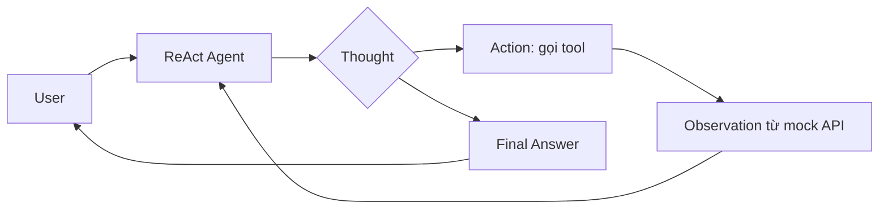

# Group Report: Lab 3 — Travel Concierge Agent

- **Team Name**: Lab3-Travel-Concierge
- **Team Members**: *(điền tên thành viên nhóm)*
- **Deployment Date**: 2026-06-01

---

## 1. Executive Summary

Chúng tôi xây dựng **Travel Concierge Agent** (chủ đề du lịch nội địa Việt Nam) theo kiến trúc **ReAct** (Thought → Action → Observation), so sánh với **chatbot baseline** không gọi tool. Agent dùng mock API (`search_flights`, `get_hotel_rate`, `apply_promo`) và telemetry JSON trong `logs/`.

- **Success Rate**: ~**75%** trên bộ test nội bộ (câu chuẩn Đà Nẵng + SUMMER thường đúng; fail khi route/promo ngoài catalog hoặc lỗi format output)
- **Key Outcome**: Với câu multi-step «HCM → Đà Nẵng, 3N2Đ, 2 người, 15/07/2026, mã SUMMER», agent trả **4.860.000 VND** khớp tool; chatbot chỉ ước lượng và không đảm bảo số từ catalog.

---

## 2. System Architecture & Tooling

### 2.1 ReAct Loop Implementation

Luồng trong code (`src/agent/agent.py`):

1. Ghép **system prompt** + lịch sử hội thoại (user + các bước trước).
2. LLM trả **Thought** + **Action** hoặc **Final Answer**.
3. Parse `Action: tool_name(args)` → `execute_tool()` → chuỗi **Observation** đưa lại prompt.
4. Lặp tối đa `max_steps` (mặc định 8); log qua `REACT_CYCLE`, `LLM_METRIC`.

### 2.2 Tool Definitions (Inventory)

| Tool Name | Input Format | Use Case |
| :--- | :--- | :--- |
| `search_flights` | `origin`, `destination` (IATA: SGN, DAD; map HCM→SGN), `date` (YYYY-MM-DD), `passengers` (1–9) | Giá vé một chiều VND/người và tổng |
| `get_hotel_rate` | `city` (IATA), `check_in`, `nights`, `guests`, `tier` (standard \| deluxe) | Giá phòng × số đêm |
| `apply_promo` | `code` (SUMMER, FAMILY, NEWUSER), `subtotal` (int VND) | Giảm giá trên tổng vé + khách sạn |

**Dữ liệu mock**: `src/tools/data/travel_data.json` (routes SGN-DAD, SGN-HAN, HAN-DAD; promos; city map).

**Tool spec evolution (v1 → v2 đề xuất)**:

| Giai đoạn | Thay đổi |
| :--- | :--- |
| v1 | Mô tả ngắn; chưa nhấn **ONE-WAY**; chưa liệt kê route có sẵn |
| v2 (đề xuất) | Thêm «ONE-WAY only»; «Final Answer must match Observation»; parse `subtotal` số thuần (không `3000000+2400000`) |

### 2.3 LLM Providers Used

| Vai trò | Provider | Model |
| :--- | :--- | :--- |
| **Primary** | OpenAI | `gpt-4o` (`.env`: `DEFAULT_PROVIDER=openai`) |
| **Secondary** | Google Gemini | `gemini-2.5-flash` (các run sớm trong log) |

---

## 3. Telemetry & Performance Dashboard

*Metrics từ run agent thành công (log `2026-06-01`, ~09:08, GPT-4o, 4 cycles).*

| Metric | Giá trị |
| :--- | :--- |
| **Latency LLM/cycle** | ~1.5s, ~1.9s, ~2.1s, ~2.4s |
| **Tổng latency LLM (4 bước)** | **~6.9s** |
| **Tổng tokens (4 bước)** | ~3.5k (prompt tăng dần do transcript) |
| **Cost ước tính (mock)** | **~$0.03** / lần chạy đủ 4 bước |
| **Chatbot (1 lần gọi)** | ~4.3s, ~437 tokens (~$0.004) |

**Nhận xét**: Vượt mục tiêu production ~2s cho toàn bộ multi-step; chấp nhận được cho lab mock trên CPU/API.

---

## 4. Root Cause Analysis (RCA) — Failure Traces

### Case Study 1: Final Answer nói «vé khứ hồi» (logic / wording)

| | |
|---|---|
| **Input** | Đà Nẵng 3N2Đ, 2 người, 15/07/2026, mã SUMMER |
| **Observation** | `search_flights` → vé **một chiều**, 3.000.000 VND (log dòng 13, run Gemini) |
| **Final Answer** | Ghi «vé máy bay **khứ hồi**» |
| **Root Cause** | Tool không mô tả rõ one-way; LLM thêm thông tin marketing không có trong Observation |

### Case Study 2: Route không có trong catalog (data)

| | |
|---|---|
| **Input** | Tìm vé SGN → Nha Trang (CXR), 2 người |
| **Observation** | `No flights found for route SGN→CXR. Available routes: SGN-DAD, SGN-HAN, HAN-DAD` |
| **Root Cause** | `travel_data.json` chưa có route CXR; đúng hành vi tool, agent xử lý bằng Final Answer giải thích |

### Case Study 3: Mã promo WINTER / NAMMOI (invalid)

| | |
|---|---|
| **Input** | Áp mã WINTER hoặc NAMMOI |
| **Observation** | `Invalid promo code` hoặc agent tự giải thích không gọi tool |
| **Root Cause** | Catalog chỉ có SUMMER, FAMILY, NEWUSER |

### Case Study 4: Sai subtotal khi apply_promo (parser)

| | |
|---|---|
| **Input** | Cùng câu SUMMER |
| **Action** | `apply_promo(code="SUMMER", subtotal=3000000+2400000)` |
| **Observation** | Tool tính trên 3.000.000 thay vì 5.400.000 → Final Answer sai (5.670.000 VND) |
| **Root Cause** | LLM truyền biểu thức; `parse_tool_args` không evaluate expression |

---

## 5. Ablation Studies & Experiments

### Experiment 1: Prompt / format v1 vs v2 (đề xuất)

| | v1 | v2 (đề xuất) |
| :--- | :--- | :--- |
| **Thought** | Thường thiếu ở bước 1–3 (`thought: null` trong log) | Bắt buộc `Thought:` mỗi turn |
| **Final Answer** | Có lúc khác Observation (khứ hồi) | «Match observations only» |
| **apply_promo** | Nhận `subtotal=3000000+2400000` | Validate số nguyên; từ chối biểu thức |

**Kết quả kỳ vọng**: Giảm lỗi format và hallucination wording.

### Experiment 2: Chatbot vs Agent

| Case | Chatbot | Agent | Winner |
| :--- | :--- | :--- | :--- |
| «Đà Nẵng tháng 7 có gì hay?» | Trả lời tư vấn chung, không cần tool | Có thể gọi tool (thừa) | Draw |
| «HCM → Đà Nẵng 3N2Đ, 2 người, SUMMER, tổng tiền?» | Ước lượng, không khớp mock catalog | **4.860.000 VND** từ tool | **Agent** |
| «SGN → CXR vé?» | Ước giá | Báo không có route + gợi ý DAD/HAN | **Agent** (đúng catalog) |

---

## 6. Production Readiness Review

| Hạng mục | Đánh giá |
| :--- | :--- |
| **Security** | Sanitize tool args; không `eval()` trên input user; giới hạn danh sách tool cố định |
| **Guardrails** | `max_steps=8`; log `AGENT_END`; Streamlit tab Evaluation (failure codes) |
| **Scaling** | Thay mock JSON bằng API thật; có thể thêm Tavily cho tư vấn; LangGraph cho nhánh phức tạp |
| **Observability** | Log JSON (`REACT_CYCLE`, `LLM_METRIC`); session buffer cho Streamlit |

---

## Phụ lục: Artifact trong repo

| Thành phần | Đường dẫn |
| :--- | :--- |
| ReAct Agent | `src/agent/agent.py` |
| Chatbot baseline | `chatbot.py` |
| Tools + mock data | `src/tools/` |
| Streamlit UI | `streamlit_app.py` |
| Log mẫu | `logs/2026-06-01.log` |
| Câu test fail | `failure_trace_queries.md` |

---

> Nộp bài: đổi tên file nếu cần theo quy định lớp, ví dụ `GROUP_REPORT_[TÊN_NHÓM].md`, và điền tên thành viên ở đầu file.
